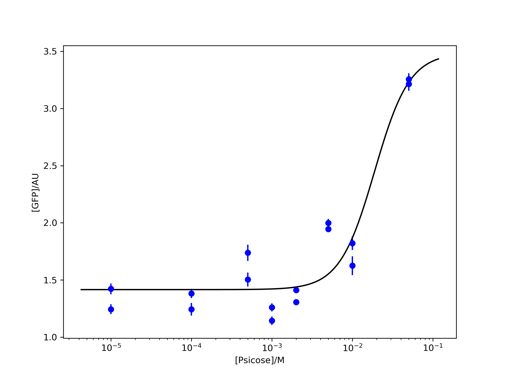

# BioLogic


Biologic is a Python package and a command line tool which infers the mechanistic model of a single biological node. Given characterization data, e.g., from a microplate reader, Biologic can automatically estimate model parameters and select the optimal model, based on mechanistic hypotheses.
"Biological nodes" are commonly regarded as *logic gates* in synthetic biology, but *biological nodes* is a more generalized term, since the nodes may have more than 2 inputs and may behave far from discretely.

## Quick Start

The Quick Start uses a [biological part](http://parts.igem.org/wiki/index.php?title=Part:BBa_K2791004) from the 2018 XJTU iGEM project. The part features a D-psicose inducible promoter.

```sh
./biologic -c config.json
```

It is easy to use the command line. It is recommended to store configurations in a file. Though, in the future, configurations may be passed directly to the command line as options.
The config file should have the fields as followed:

```json
{
    "units": {
        "inputUnits": "M",
        "outputUnits": "AU"
    },
    "tags": {
        "inputTags": ["Psicose"],
        "outputTag": "GFP",
        "experimentTags": ["Exp1", "Exp2"]
    },
    "dataPath": "data/BBa_K2791004.json",
    "modelSet": "Activation_System",
    "methods": {
        "paraEstimator": "Nelder_Mead",
        "infoCriteria": "AIC"
    },
    "figPath": "data/BBa_K2791004.png"
}
```

The "units" and "tags" offers additional information to the input data. "dataPath" specifies the path to such input file. "modelSet" asks the user to choose a keyword which refers to the set of mechanistic hypotheses as model candidates.
The "method" field assigns the algorithms for parameter estimation or model selection.
Details of available keyword please refer full [Documentations](docs/modelBase.md).

The results would be like:

```
#1 model calculating...
A*alpha + K*b
-------------
 beta*(A + K)
Type = Inducible
Specs = Michaelis_Menten, Basal_expression, Activation
Parameters:
alpha = 1.7956828304895099e-06, beta = 6.715611346991595e-07, b = 7.634137876835703e-07, K = 0.003402318454950439
Residue = 2.2724
IC = -19.5914

... ...

#30 model calculating...
           n
          K *b
------------------------
     /                n\
     |     /       2 \ |
     | n   |  A*K_I  | |
beta*|K  + |---------| |
     |     | 2      2| |
     \     \I  + K_I / /
Type = Inducible
Specs = Hill, No_basal_expression, Inducer_Quadratic, Repression, Inducer_Repression, Inducer
Parameters:
beta = 0.02170608718198557, b = 0.22919855389527066, K = 3.3504046038232686e-09, n = 0.15253056333394976, A = 0.0014373552873615742, K_I = 0.0013820565707686108
Residue = 0.8132
IC = -26.3361
=============================================
#31 model calculating...
           n
          K *b
------------------------
     /                n\
     |     /       2 \ |
     | n   |  A*K_I  | |
beta*|K  + |---------| |
     |     | 2      2| |
     \     \I  + K_I / /
Type = Inducible
Specs = Hill, No_basal_expression, Inducer_Quadratic, Repression, Inducer_Repression, Inducer
Parameters:
beta = 0.03161993553042397, b = 0.3953910996073251, K = 4.318742065184359e-07, n = 0.6554594267367695, A = 0.0010628187831676099, K_I = 0.00012505477781205108
Residue = 0.5264
IC = -9.7695
=============================================
Model Choice:
                      n
 n           /  A*I  \
K *b + alpha*|-------|
             \I + K_I/
-----------------------
      /              n\
      | n   /  A*I  \ |
 beta*|K  + |-------| |
      \     \I + K_I/ /
Type = Inducible
Specs = Hill, Basal_expression, Inducer_Michaelis_Menten, Activation, Inducer_Activation, Inducer
Parameters:
alpha = 2.2075008428793392, beta = 0.03411241178321088, b = 0.0015438590237552732, K = 0.0013900301015426293, n = 2.434265912707475, A = 0.0007830050667632467, K_I = 0.0024753174437969847
Residue = 0.3143
IC = -11.8944
```

Accroding to the settings in configuration file, there will also be a figure plotting the best figure:



## Liscense

GPLv3
